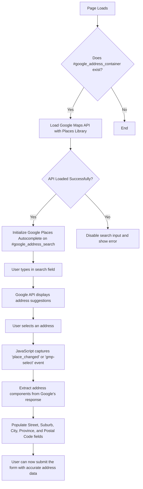

# Product Requirements Document: Google Places Address Autocomplete

## 1. Introduction & Objective

This document outlines the requirements for implementing a Google Places Autocomplete feature on a web form. The primary objective is to simplify the process of entering a physical address for users, thereby improving user experience and data accuracy. When a user starts typing an address, the feature will suggest matching addresses from Google's database. Upon selection, the form's address fields (street, suburb, city, province, postal code) will be automatically populated.

## 2. Functional Requirements

### 2.1. User Interface (HTML)

- **Address Search Input:** The form must include a text input field where users can type to search for an address.
- **Address Fields:** The form must contain separate input fields for the components of an address:
    - Street Address (e.g., `address_line_1`)
    - Suburb (e.g., `residential_suburb`)
    - City/Town (e.g., `city_town`)
    - Province/Region (e.g., `province_region`)
    - Postal Code (e.g., `postal_code`)
- **Container Element:** A container element (e.g., a `<div>`) should wrap the search input field to facilitate JavaScript targeting.

**Example HTML Structure:**

```html
<!-- Search Input Field -->
<div id="google_address_container">
    <label for="google_address_search">Search Address</label>
    <input type="text" id="google_address_search" placeholder="Start typing an address...">
</div>

<!-- Address Component Fields -->
<input type="text" id="address_line_1" name="address_line_1" placeholder="Street Address">
<input type="text" id="residential_suburb" name="residential_suburb" placeholder="Suburb">
<input type="text" id="city_town" name="city_town" placeholder="City/Town">
<select id="province_region" name="province_region">
    <!-- Options for provinces -->
</select>
<input type="text" id="postal_code" name="postal_code" placeholder="Postal Code">
```

### 2.2. Core Functionality (JavaScript)

- **Google Maps API Loading:** The implementation must include a mechanism to load the Google Maps JavaScript API, specifically including the `places` library. This should be done asynchronously.
- **Autocomplete Initialization:**
    - The script must check for the existence of the `google_address_container` on the page before attempting to initialize the autocomplete functionality.
    - It should be able to initialize using both the modern `PlaceAutocompleteElement` and the legacy `google.maps.places.Autocomplete` service for backward compatibility.
- **Event Handling:** The script must listen for the user selecting a suggested address.
- **Form Population:** Upon address selection, the script must:
    - Retrieve the detailed address components from the Google Places data.
    - Parse the components to identify the street number, route, suburb, city, province, and postal code.
    - Populate the corresponding form fields with the extracted data.
- **Error Handling:** If the Google Maps API fails to load, the search input should be gracefully disabled or hidden, informing the user that the address search is unavailable.

## 3. Technical Requirements

- **Google Maps API Key:** A valid Google Maps API key with the "Places API" and "Maps JavaScript API" enabled is required.
- **API Loading:** The Google Maps API script should be loaded in the HTML, preferably at the end of the `<body>` tag.
    ```html
    <script src="https://maps.googleapis.com/maps/api/js?key=YOUR_API_KEY&libraries=places&callback=initializeGooglePlaces" async defer></script>
    ```
    *Note: The `callback` parameter is used with the legacy API. The modern approach involves using `await google.maps.importLibrary("places")`.*
- **Regional Bias:** The autocomplete search should be biased towards a specific country (e.g., South Africa - 'za') to provide more relevant suggestions.
- **Dependencies:** The solution can be implemented with vanilla JavaScript or with the help of a library like jQuery for DOM manipulation.

## 4. Implementation Flow (Mermaid Diagram)



This document provides the necessary details to replicate the Google Places Autocomplete functionality in another project.